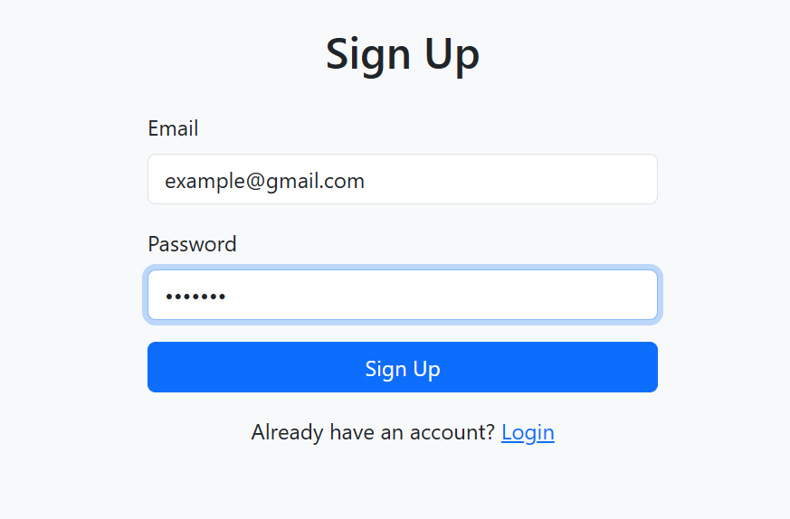
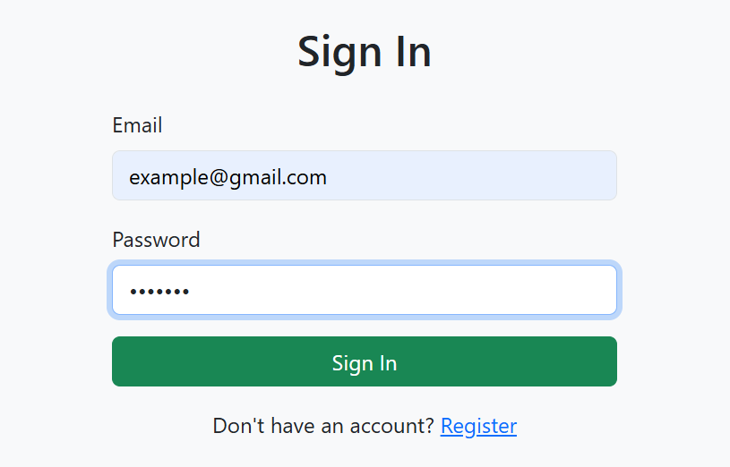

## Node.js Authentication System

This project is a simple **user authentication system** built using Node.js, Express.js, and MongoDB.
It allows users to register and login securely.
User passwords are **hashed using bcrypt** before storing them in the database.this project helps me how to build a basic backend development.

## 🚀 Features
```
 👉User Signup
 👉User Login
 👉Password Hashing using bcrypt
 👉Duplicate Email Validation
 👉MongoDB Database Storage
 👉Simple UI using Bootstrap
 👉Basic authentication flow
```

## 🛠 Technologies Used
  👩‍💻Node.js
  👩‍💻 Express.js
  👩‍💻 MongoDB
  👩‍💻bcrypt
  👩‍💻Bootstrap
  👩‍💻HTML

## 📚 Learning 
```
  ✅This project helps beginners understand:
  ✅Backend development with Node.js
  ✅Authentication logic
  ✅Password security with bcrypt
  ✅MongoDB database operations
```

## 📁Project Structure
```
├── auth
│   ├── public
    │   ├── signup.html
    │   ├── signin.html
    │   └── welcome.html
    ├── screenshots
    │   ├── signup.png
    │   ├── signin.png
    │   └── welcome.png
    ├── server.js
    ├── package.json
    ├── package-lock.json
    └── .gitignore
```
## 📷 Screenshots

 ### Signup Page
 

 ### Signin Page
 

 ### Welcome Page
 
 
## ⚙️ Installation
## Clone the repository
git clone https://github.com/ThulaseswaraReddy/Nodejs-Authentication-System.git

## Navigate to project folder
cd Nodejs-Authentication-System

## Install dependencies
npm install

## Run the server
node server.js

## Server will start at:
http://localhost:3000

## 🔐 Authentication Flow
 👉User opens signup page
 👉User registers with email and password
 👉Password is hashed using bcrypt
 👉Data is stored in MongoDB
 👉User signs in with credentials
 👉If valid → redirected to welcome page
